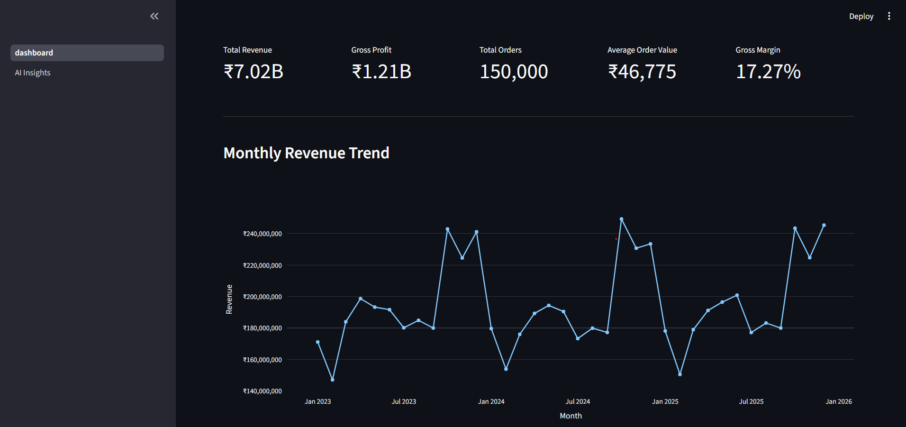
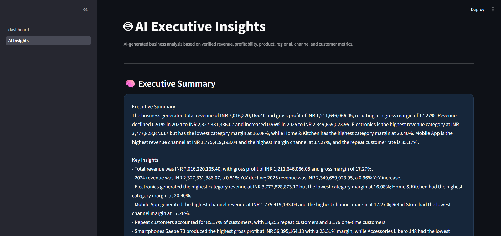
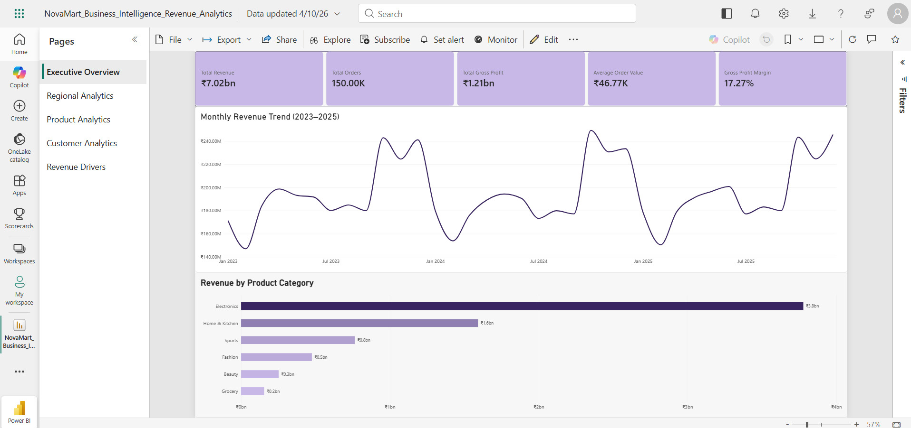

# NovaMart Business Intelligence & Revenue Analytics

An end-to-end Business Intelligence and Revenue Analytics platform that combines PostgreSQL, Python ETL, SQL analytics, Power BI, and AI-generated executive insights.

## Project Overview

NovaMart Business Intelligence analyzes e-commerce sales, customer, product, regional, and revenue data through a complete analytics pipeline.

The platform transforms raw transactional data into:

- Executive business KPIs
- Revenue and profit analytics
- Product and category performance
- Regional performance
- Customer retention and RFM segmentation
- Revenue driver analysis
- AI-generated executive insights
- Interactive Power BI dashboards

## Dashboard Preview

### Executive Overview



### AI Executive Insights



### Power BI Dashboard



## Architecture

Raw CSV Data
      ↓
Python / Pandas ETL
      ↓
PostgreSQL
      ↓
SQL Analytics
      ↓
Business Driver Analysis
      ↓
AI Executive Insights
      ↓
Streamlit + Power BI

## Technology Stack

- Python 3.10
- Pandas
- NumPy
- Faker
- PostgreSQL 16
- SQL
- SQLAlchemy
- Power BI
- DAX
- Streamlit
- Plotly
- OpenRouter / LLM
- Git / GitHub

## Key Features

### Executive Analytics

The platform calculates:

- Total Revenue
- Gross Profit
- Gross Margin
- Total Orders
- Average Order Value
- Monthly Revenue Trends

### Product Analytics

- Revenue by category
- Top products by revenue
- Top products by gross profit
- Product-level margin analysis
- Discount analysis

### Regional Analytics

- Revenue by region
- Gross profit by region
- Regional gross margins

### Customer Analytics

- Repeat vs one-time customers
- Customer revenue
- Customer order frequency
- RFM segmentation
- Customer retention analysis

### AI Executive Insights

The analytics engine first calculates verified business metrics using SQL and Python.

The AI layer then converts those metrics into:

- Executive Summary
- Key Business Insights
- Areas to Monitor
- Recommended Actions

The LLM does not calculate the underlying business metrics and is instructed not to invent unsupported facts.

## Current Business Results

Based on the generated dataset:

| Metric | Result |
|---|---:|
| Total Revenue | ₹7.02B |
| Gross Profit | ₹1.21B |
| Gross Margin | 17.27% |
| Total Orders | 150,000 |
| Purchasing Customers | 21,434 |
| Average Order Value | ₹46,775 |
| Repeat Customer Rate | 85.17% |

### Major Findings

- Electronics generated the highest revenue at approximately ₹3.78B.
- Home & Kitchen had the highest category margin at 20.40%.
- West generated the highest regional revenue at approximately ₹1.46B.
- Mobile App generated the highest channel revenue at approximately ₹1.78B.
- Smartphones Saepe 73 generated the highest gross profit among products at approximately ₹56.4M.
- Accessories Libero 148 had an 8.43% margin among the top revenue products.

## Project Structure

```text
ai-business-intelligence/
│
├── app/
│   ├── dashboard.py
│   └── pages/
│       └── 2_AI_Insights.py
│
├── data/
│   ├── raw/
│   └── processed/
│
├── database/
│   ├── schema.sql
│   └── analytics/
│       ├── 01_executive_metrics.sql
│       ├── 02_product_analytics.sql
│       ├── 03_customer_analytics.sql
│       └── 04_rfm_segmentation.sql
│
├── powerbi/
│   └── NovaMart_Business_Intelligence_Revenue_Analytics.pbix
│
├── src/
│   ├── data_generation.py
│   ├── data_validation.py
│   ├── load_data.py
│   ├── generate_insights.py
│   ├── analyze_drivers.py
│   └── generate_ai_summary.py
│
├── screenshots/
├── requirements.txt
├── .gitignore
└── README.md

## Running the Project

### 1. Clone the repository

```bash
git clone <your-github-repository-url>
cd ai-business-intelligence

2. Create and activate the virtual environment

python -m venv venv
venv\Scripts\activate

3. Install dependencies

pip install -r requirements.txt

4. Start PostgreSQL

Make sure PostgreSQL is running before loading the data.

5. Load the data

python src\load_data.py

6. Generate analytics

python src\generate_insights.py
python src\analyze_drivers.py

7. Configure the AI API key

$env:OPENROUTER_API_KEY="YOUR_API_KEY"

Then:

python src\generate_ai_summary.py

8. Launch the application

streamlit run app\dashboard.py

The Streamlit application will open in your browser.